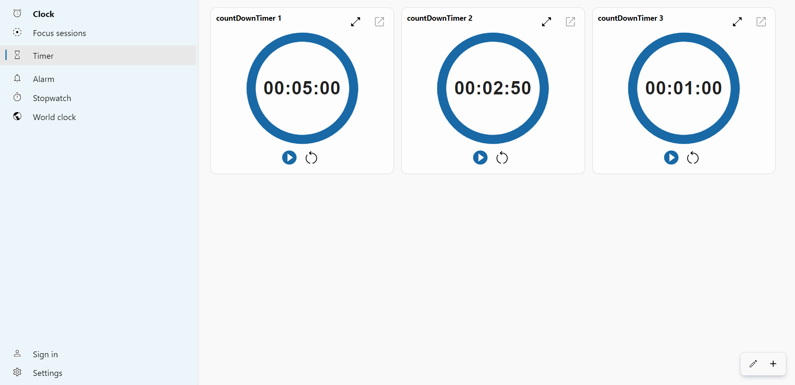
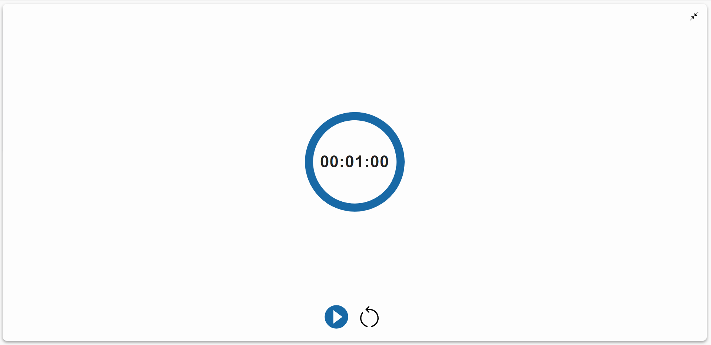

# Windows Timer App

A full clone of the timer feature found within the Windows Clock app

## Live Site

http://windows-timer-app.surge.sh/

## Run Locally

Clone the project

```bash
  git clone https://github.com/mfahad24/timer-app.git
```

Go to the project directory

```bash
  cd timer-app
```

Install dependencies

```bash
  npm install
```

Start the app

```bash
  npm run start
```

## Running Tests

To run tests, run the following command

```bash
  npm run test
```

## Tech Stack

**Client:** React, React Hooks, TypeScript Axios,
Modular CSS, Material UI

**Server:** Node, Express

**Database:** MySQL

## Features

The user is able to:

- Create a timer with specifications
- Delete a timer
- Maximize/minimize single timer card

## Screenshots






